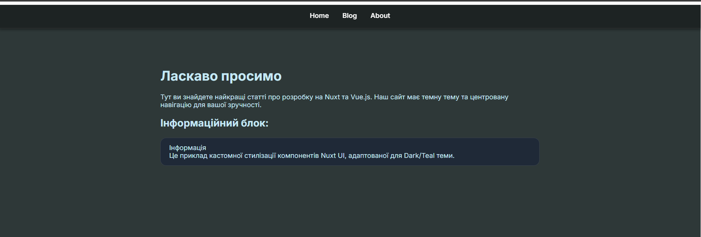
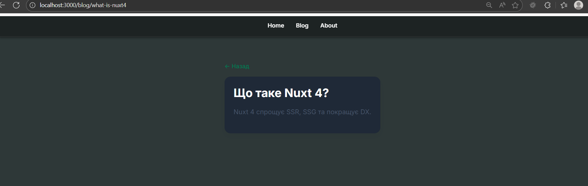

### Лабораторна робота 6: Nuxt Course Blog

## Скріншоти основних сторінок



/blog


/blog/[slug]


/about

---

### Метод useFetch використовується:

- pages/blog.vue: Використовується для асинхронного отримання списку всіх доступних статей: const { data: posts } = await useFetch("/api/posts");. Це забезпечує відображення актуального списку статей.

- pages/blog/[slug].vue: Використовується для отримання однієї конкретної статті за її slug (ідентифікатором): await useFetch(\/api/posts/${route.params.slug}`)`.

- Код API (Server Routes):
Усі дані (список постів та деталі постів) імітуються через API-роути на базі Nitro (вбудованого сервера Nuxt).

### Список постів: server/api/posts.ts

Один пост за slug: server/api/posts/[slug].ts

### Налаштування SEO-тегів (Head Management)

Використано функцію useSeoMeta (для глобальних тегів) та useHead (для динамічних змін).

- pages/index.vue та pages/about.vue: Використовують статичний useSeoMeta для визначення title, description, ogTitle та ogDescription.

- pages/blog.vue: Використовує статичний useSeoMeta для списку статей.

- pages/blog/[slug].vue (Приклад динаміки): На цій сторінці useSeoMeta використовується динамічно після отримання даних, щоб включити заголовок та опис конкретної статті:

```
useSeoMeta({
title: post.value.title + ' — Nuxt Course Blog',
description: post.value.content.slice(0, 150),
// 
});
```


### Перевірка
Відкрити у браузері:
`http://localhost:3000/sitemap.xml`
---
## robots.txt — модуль @nuxtjs/robots

Для керування індексацією використовується модуль `@nuxtjs/robots`.

Конфігурація у `nuxt.config.ts`:

```ts
robots: {
  allow: ["/", "/about", "/blog"],
    disallow: ["/admin", "/api", "/api/*"]
}

```
Дозволено індексувати:
- /
- /about
- /blog
- /blog[slug]

Заборонено індексувати:
- /admin
- /api/*
### Перевірка
Оскільки у dev-режимі Nuxt блокує індексацію, перевірку потрібно робити так:
`http://localhost:3000/robots.txt?mockProductionEnv`
---
## Використані компоненти Nuxt UI

У проєкті використовується бібліотека Nuxt UI. Її компоненти застосовано на кількох сторінках

### На сторінці `/`
- `UContainer`
- `UCard`
- `UButton`
- `UAlert`

### На сторінці `/blog`
- `UContainer`
- `UCard`
- `UAlert`

### На сторінці `/blog/[slug]`
- `UContainer`
- `UCard`
- `UAlert`

### У лейауті (layouts/default.vue)
- `UContainer` — використовується для структурування контенту всіх сторінок

### Стилізація
Усі компоненти Nuxt UI стилізовані вручну за допомогою:

```html
<style scoped>
```

## Project Setup

```sh
npm install
```

### Compile and Hot-Reload for Development

```sh
npm run dev
```

### Compile and Minify for Production

```sh
npm run build
```
